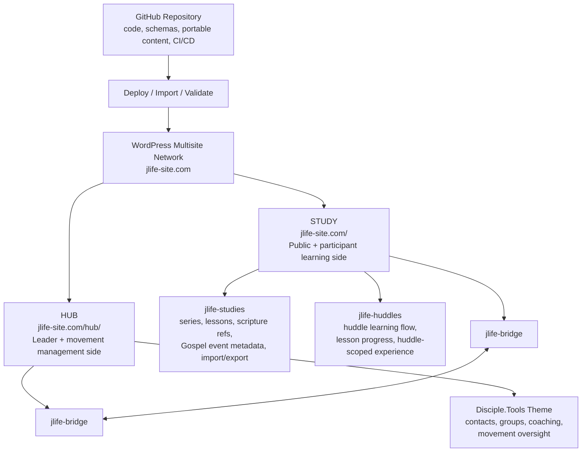
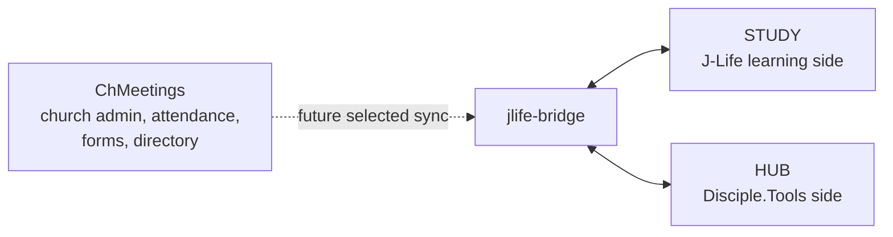
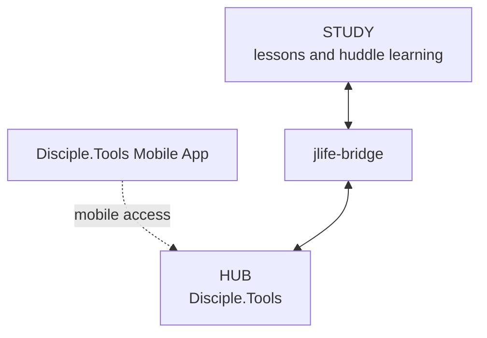
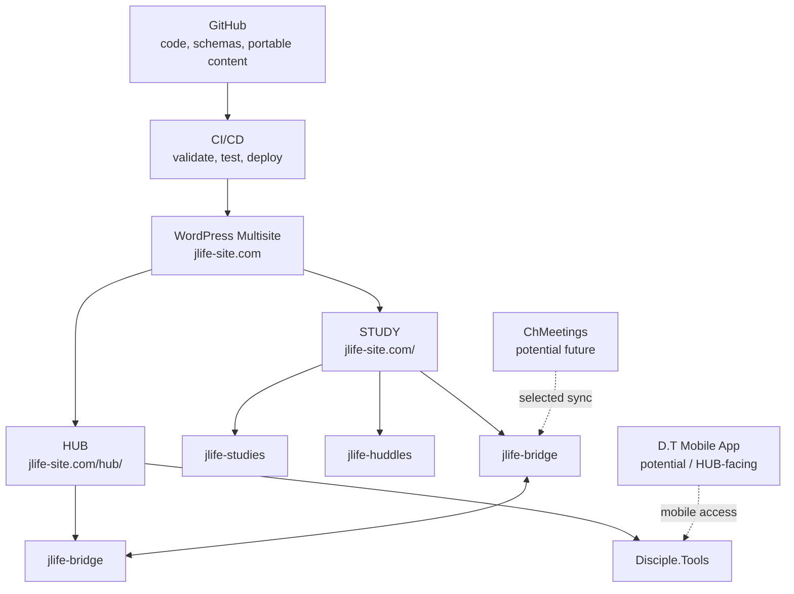

# J-Life System Primer

## Purpose

This primer explains how the J-Life platform fits together: STUDY, HUB, Disciple.Tools, the custom J-Life plugins, and possible future integrations such as ChMeetings and the Disciple.Tools Mobile App.

The goal is to help pastors, product reviewers, developers, and ministry partners understand the system at a high level before discussing implementation details.

## One-sentence summary

J-Life is a WordPress multisite platform with two connected halves:

- STUDY delivers lesson content and huddle learning experiences.
- HUB uses Disciple.Tools to manage people, groups, coaching, and movement oversight.

The two sides cooperate through `jlife-bridge`, but they should not be treated as one large mixed application.

## Core idea

```text
Content and study flow belong on STUDY.
People, groups, and movement oversight belong on HUB.
Cross-site coordination belongs in the bridge.
```

## System overview



## The two main sites

| Site | URL | Primary audience | Main responsibility |
| --- | --- | --- | --- |
| STUDY | `jlife-site.com/` | Participants, huddle leaders, public visitors | Lessons, series, huddle learning flow |
| HUB | `jlife-site.com/hub/` | Leaders, coaches, admins | Disciple.Tools contacts, groups, coaching, oversight |

## Multisite, themes, and plugins

J-Life is intended to run as a WordPress multisite network.

That means:

- WordPress core is shared.
- Themes and plugins are installed once in the network.
- Each subsite can activate the theme and plugins it needs.
- Not every plugin or theme should be active everywhere.

The HUB site should use the Disciple.Tools theme. The STUDY site should use the public/STUDY-facing theme.

## Suggested activation model

| Component | STUDY | HUB | Notes |
| --- | --- | --- | --- |
| STUDY/public theme | Active | Not active | Displays public and participant-facing learning experience |
| Disciple.Tools theme | Not active | Active | HUB is the Disciple.Tools environment |
| `jlife-studies` | Active | Usually not active | Owns the J-Life content model |
| `jlife-huddles` | Active | Usually not active | Owns huddle learning workflow |
| `jlife-bridge` | Active | Active or network-active | Coordinates controlled cross-site integration |
| Disciple.Tools plugins | Not usually active | Active as needed | Used by HUB for movement operations |

This table is a starting model, not a hard rule. If later implementation requires a plugin to be network-active, that should be documented in the relevant issue or deployment notes.

## What each plugin does

### `jlife-studies`

`jlife-studies` owns the lesson content model.

It is responsible for making J-Life study content work inside WordPress.

Likely responsibilities:

- Register series and lesson content types.
- Store lesson metadata.
- Reference Robertson Gospel event IDs.
- Store scripture references.
- Store phase and sub-phase fields after ministry review.
- Import portable lesson content into WordPress.
- Export WordPress lesson content back into portable files.
- Render lesson and series content on STUDY.

It should not own private huddle discussion, participant prayer requests, or live ministry data.

### `jlife-huddles`

`jlife-huddles` owns how a huddle moves through study content.

Disciple.Tools can manage groups, but a J-Life huddle is not only a group record. A huddle also has a learning journey.

Likely responsibilities:

- Connect a huddle to a current series or lesson.
- Track huddle-specific lesson flow.
- Manage participant-facing huddle access.
- Support lesson progress for a huddle.
- Provide leader-facing study prompts or huddle context.
- Eventually support huddle-scoped discussion or reflection, if approved.

It should not replace Disciple.Tools as the system of record for movement contacts, groups, and coaching.

### `jlife-bridge`

`jlife-bridge` connects STUDY and HUB.

It should coordinate the two worlds without mixing their responsibilities.

Likely responsibilities:

- Map a J-Life huddle to a Disciple.Tools group.
- Map a STUDY user to a HUB user/contact context.
- Provide controlled cross-site APIs.
- Enforce capability checks for cross-site reads and writes.
- Keep STUDY and HUB coordinated without exposing private data accidentally.

The bridge is especially important because WordPress multisite shares authentication across the network. Separation must be enforced by capabilities and explicit access checks, not by assuming that `/hub/` is isolated by login alone.

## Disciple.Tools role

Disciple.Tools is the movement-management system on HUB.

It is strong at:

- Contacts
- Groups
- Coaching
- Follow-up
- Movement reporting
- Operational disciple-making workflows

Disciple.Tools is not intended to be the main lesson reader or participant study experience. That belongs to STUDY.

## STUDY vs HUB responsibility split

| Question | Belongs primarily to |
| --- | --- |
| What lesson is this huddle studying? | `jlife-huddles` / STUDY |
| What does this participant see next? | `jlife-huddles` / STUDY |
| What is the content of this lesson? | `jlife-studies` / STUDY |
| What Gospel event does this lesson connect to? | `jlife-studies` / portable content |
| Who belongs to this group? | Disciple.Tools / HUB |
| Who coaches this leader? | Disciple.Tools / HUB |
| How does STUDY know which HUB group matches this huddle? | `jlife-bridge` |
| Who can see leader-only or private huddle information? | `jlife-huddles` + `jlife-bridge` capability checks |

## Content model

J-Life content should be portable and version-controlled.

Authored content should live in the repository as structured files, then be imported into WordPress.

Examples:

- Series
- Lessons
- Scripture references
- Teaching sections
- Reflection prompts
- Prayer prompts
- Leader notes
- Gospel event references
- Phase/sub-phase metadata after ministry review

The database can render and manage content, but the database should not be the only home of authored content.

## Live ministry data

Live ministry data belongs in the production database and should not be overwritten from local development.

Examples:

- Real users
- Disciple.Tools contacts
- Disciple.Tools groups
- Huddle participation
- Participant progress
- Private notes
- Prayer requests
- Live ministry activity

This is why deployment should not mean copying a local database into production.

## Deployment model

Recommended flow:

```text
Local development
  -> GitHub pull request
  -> CI checks
  -> staging deploy
  -> human smoke test
  -> production deploy
```

CI should test and validate the code and content before anything is deployed.

Production deployment should:

- deploy code
- run setup or migration commands
- import approved starter content
- create or invite real initial users
- avoid importing mock users and fake huddles

## First production bootstrap

Automatic bootstrap can safely create deterministic things:

- plugin defaults
- required roles and capabilities
- homepage if missing
- menus if missing
- front-page assignment
- starter approved content
- import/version markers
- sanity-check logs

Manual setup should handle sensitive or contextual things:

- production secrets
- DNS and SSL confirmation
- real admin invitations
- real Disciple.Tools contacts/groups
- privacy review
- final launch approval

## Future integration: ChMeetings

ChMeetings is not core to the first J-Life platform, but it may become a useful church-management sidecar.

Potential future uses:

- Church directory or household data
- Attendance
- Forms
- Event registration
- Volunteer or ministry team data
- Selected sync into J-Life workflows

ChMeetings should not own lesson content or huddle study flow.



## Future integration: Disciple.Tools Mobile App

The Disciple.Tools Mobile App naturally belongs to the HUB side.

Likely role:

- Mobile access to Disciple.Tools contacts
- Mobile access to groups
- Mobile follow-up and movement activity
- Leader/coach operational work

It should not be treated as the main STUDY lesson-reading experience.

Potential future bridge:

- expose summary huddle status from STUDY into HUB
- let mobile leaders see which lesson a huddle is on
- surface movement-level signals, not private participant reflections



## Full ecosystem view



## Decision guide

When deciding where a feature belongs, ask:

| If the feature is about... | Put it in... |
| --- | --- |
| Lesson content | `jlife-studies` |
| Series and lesson import/export | `jlife-studies` |
| Huddle learning flow | `jlife-huddles` |
| Participant progress through lessons | `jlife-huddles` |
| D.T contacts and groups | Disciple.Tools / HUB |
| Coaching and movement oversight | Disciple.Tools / HUB |
| STUDY-to-HUB mapping | `jlife-bridge` |
| Church attendance/forms/directory | ChMeetings, as future side integration |
| Mobile contact/group management | D.T Mobile App / HUB |
| Private participant reflections or prayer requests | Treat as sensitive huddle data; do not expose broadly |

## Common misunderstandings

### Is STUDY just normal WordPress posts and pages?

Not exactly.

The public shell may use normal pages, but J-Life lessons and series should use the structured content model managed by `jlife-studies`.

### Is a J-Life huddle just a Disciple.Tools group?

Not exactly.

A D.T group is the movement-management record. A J-Life huddle is also a learning workflow moving through content. The two should be connected, not collapsed into one thing.

### Does the D.T Mobile App replace the STUDY experience?

No.

The mobile app is mainly for HUB-side movement operations. STUDY remains the participant-facing learning experience.

### Should production receive mock users and test huddles?

No.

Mock users and fake huddles belong in local development and testing. Production should only get real users and approved starter content.

## Short explanation for non-technical leaders

J-Life has two connected spaces.

The first space is STUDY. That is where people read lessons and move through discipleship content with their huddle.

The second space is HUB. That is where leaders and coaches manage people, groups, and movement oversight using Disciple.Tools.

The custom J-Life plugins keep those two spaces working together:

- `jlife-studies` handles the lesson library.
- `jlife-huddles` handles the huddle learning journey.
- `jlife-bridge` connects STUDY and HUB safely.

ChMeetings and the Disciple.Tools Mobile App may help later, but they are not the heart of the first J-Life build.
