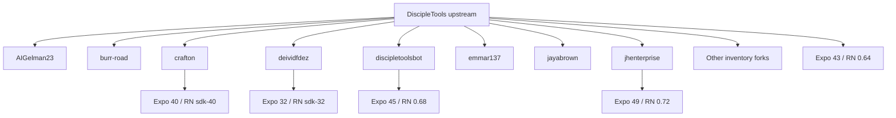
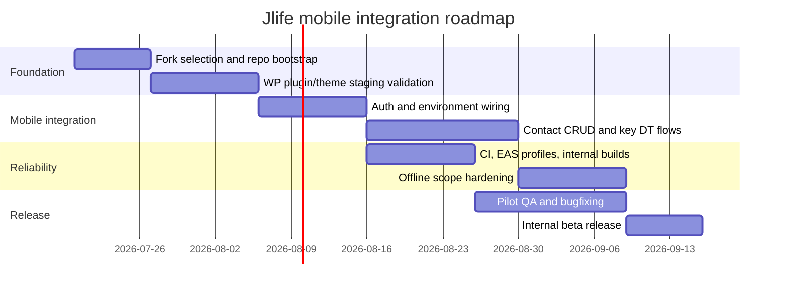

> **Research archive — not authoritative.** Deep-research LLM report received
> 2026-07-17 (source: owner-run deep-research tool; inline `citeturn…`
> markers are artifacts of that tool and are non-functional here). Claims are
> point-in-time and unverified by this project. This report fed the **mobile
> app posture** decision; the outcome — leader app consumed as official
> product, participants stay PWA/magic-link, no fork — is recorded in
> [disciple-tools-landscape.md §4.5](../disciple-tools-landscape.md). Read
> the curated doc first; use this file only to audit or re-derive that
> decision. Rules: [README.md](README.md).

---

# Disciple.Tools Mobile App Ecosystem Review for Jlife-Platform

## Executive summary

The Disciple.Tools mobile-app ecosystem is real but fragmented. As of July 17, 2026, the upstream repository `DiscipleTools/disciple-tools-mobile-app` shows 16 stars, 18 forks, 110 open issues, and 5 open pull requests; its default branch is `development`, and the default branch currently shows its last update on August 11, 2023. In other words, the project still has visible community interest, but the official app repository itself is not actively moving at a pace that would make it a low-risk foundation for a fresh ministry product without additional ownership on your side. citeturn17view0turn30view0

The fork network also does not match the "16 forks" assumption in your prompt. GitHub currently lists 18 forks in the network view, including `AIGelman23`, `burr-road`, `crafton`, `deividfdez`, `discipletoolsbot`, `emmar137`, `jayabrown`, `jhenterprise`, `jl0325`, `MaxwellDG`, `micahmills`, `mikeallbutt`, `myarrowapp`, `Shady-Hakim`, `squigglybob`, `wzcblair`, `yorkaspacher`, and `zdmc23`. That discrepancy matters, because the best technically usable base is not the most recently updated repo, and the most recently updated repos are not necessarily the most modern. citeturn40view0

The strongest technical candidates are not the upstream repo, but two forks that materially advanced the mobile stack: `discipletoolsbot/disciple-tools-mobile-app`, which moved to Expo 45 / React Native 0.68 / React 17 with Axios 1.x, SWR, Redux Persist, and dev-client workflows, and `jhenterprise/disciple-tools-mobile-app`, which moved further to Expo 49 / React Native 0.72.3 / React 18 with EAS, Expo dev client, Axios 1.x, SWR, Redux Persist, and more modern navigation/native dependencies. By contrast, upstream is still on Expo 43 / React Native 0.64.3, while some still-active forks like `crafton` and `jayabrown` show surprisingly recent commit dates but much older app stacks, which is a warning against choosing purely by "latest commit" alone. citeturn27view0turn27view1turn39view1turn39view0turn31view0turn39view3

For Jlife-Platform specifically, your current repo is already oriented toward a WordPress multisite plus Disciple.Tools direction. It uses `@wordpress/env` 10, requires Node `>=20`, and runs a local environment configured for WordPress `7.0` and PHP `8.2`; its PHP tooling is already aligned with WordPress coding standards and static analysis. That means Jlife is already much closer to the Disciple.Tools backend and plugin model than to a from-scratch greenfield mobile stack. citeturn21view0turn43view0turn43view1turn43view2turn43view3turn42view0

My recommendation is to avoid a straight upstream adoption as your primary base. The most practical path is either:  
- a custom Jlife fork seeded from `jhenterprise/disciple-tools-mobile-app`, while contributing backend/plugin fixes upstream where possible; or  
- if you want a lower-modernization step and can tolerate older React Native, seed from `discipletoolsbot/disciple-tools-mobile-app`.  

If you force a single "base this on one fork" answer, I would choose `jhenterprise/disciple-tools-mobile-app` because it is the closest inspected fork to a still-supportable Expo/React Native baseline for a 2026 ministry mobile product, even though it still needs active maintenance and integration hardening. citeturn37view3turn38view7turn39view0turn36view2

## Ecosystem inventory

GitHub currently lists 18 forks, not 16. That is the ground-truth network snapshot I used for this review. citeturn40view0

### Upstream and fork links

Upstream:
- `DiscipleTools/disciple-tools-mobile-app` citeturn1view0

Forks currently listed by GitHub:
- `AIGelman23/disciple-tools-mobile-app` citeturn7view0
- `burr-road/disciple-tools-mobile-app` citeturn7view1
- `crafton/disciple-tools-mobile-app` citeturn7view2
- `deividfdez/disciple-tools-mobile-app` citeturn7view3
- `discipletoolsbot/disciple-tools-mobile-app` citeturn33view0
- `emmar137/disciple-tools-mobile-app` citeturn33view1
- `jayabrown/disciple-tools-mobile-app` citeturn33view2
- `jhenterprise/disciple-tools-mobile-app` citeturn33view3
- `jl0325/disciple-tools-mobile-app` citeturn41view0
- `MaxwellDG/disciple-tools-mobile-app` citeturn41view1
- `micahmills/disciple-tools-mobile-app` citeturn41view2
- `mikeallbutt/disciple-tools-mobile-app` citeturn41view3
- `myarrowapp/disciple-tools-mobile-app` citeturn40view0
- `Shady-Hakim/disciple-tools-mobile-app` citeturn40view0
- `squigglybob/disciple-tools-mobile-app` citeturn40view0
- `wzcblair/disciple-tools-mobile-app` citeturn40view0
- `yorkaspacher/disciple-tools-mobile-app` citeturn40view0
- `zdmc23/disciple-tools-mobile-app` citeturn40view0

### What the inspected repos say about the network

The upstream repo is still the community reference point, but the metadata is a maintenance warning: 16 stars, 18 forks, 110 open issues, and 5 open PRs, with the default branch last updated in August 2023. That is a valid starting point for archaeology and API understanding, but not a strong production-maintenance signal by itself. citeturn17view0turn30view0

Among the forks I inspected directly, most have 0 stars and 0 forks of their own. Several are clearly dormant clones, such as `AIGelman23` with the default branch last updated March 27, 2022, `burr-road` last updated October 29, 2020, `emmar137` last updated October 15, 2020, and `deividfdez` last updated November 30, 2023. A few are more interesting: `crafton` shows a default-branch update on January 7, 2026, `jayabrown` on June 11, 2025, `jhenterprise` on May 7, 2024, and `discipletoolsbot` on October 25, 2023. Those dates matter, but only when read together with the actual dependency stack. citeturn28view0turn29view0turn36view0turn29view2turn29view1turn36view1turn36view2turn35view0

### Comparison table of the inspected repositories

The table below is compiled from each repo's GitHub landing page, branch page, and `package.json`. For the remaining low-signal forks that I did not fully deep-audit line-by-line, I treat them as inventory items rather than adoption candidates unless a later pass shows meaningful divergence. citeturn1view0turn7view0turn7view1turn7view2turn7view3turn33view0turn33view1turn33view2turn33view3turn41view0

| Repo | Default branch | Latest default-branch update | Stars | Forks | Open issues | Open PRs | Approximate stack lineage | Initial read |
|---|---|---:|---:|---:|---:|---:|---|---|
| Upstream | development | 2023-08-11 | 16 | 18 | 110 | 5 | Expo 43 / RN 0.64 / Axios + SWR | Official reference, stale |
| AIGelman23 | development | 2022-03-27 | 0 | 0 | n/a | 0 | Expo 43 / RN 0.64 / Axios + SWR | Dormant snapshot of newer upstream |
| burr-road | development | 2020-10-29 | 0 | 0 | n/a | 0 | Expo 39 / RN sdk-39 / Redux-Saga | Old |
| crafton | development | 2026-01-07 | 0 | 0 | n/a | 0 | Expo 40 / RN sdk-40 / Redux-Saga | Recently touched, older stack |
| deividfdez | master | 2023-11-30 | 0 | 0 | n/a | 0 | Expo 32 / RN sdk-32 / Redux-Saga | Very old |
| discipletoolsbot | development | 2023-10-25 | 0 | 0 | n/a | 0 | Expo 45 / RN 0.68 / Axios + SWR | Strong modernization fork |
| emmar137 | development | 2020-10-15 | 0 | 0 | n/a | 0 | Expo 38 / RN sdk-38 / Redux-Saga | Old |
| jayabrown | master | 2025-06-11 | 0 | 0 | n/a | 0 | Expo 32 / RN sdk-32 / Redux-Saga | Recently touched, but ancient stack |
| jhenterprise | development | 2024-05-07 | 0 | 0 | n/a | 0 | Expo 49 / RN 0.72 / Axios + SWR | Best technical base inspected |
| jl0325 | development | not fully audited | 0 | 0 | n/a | 0 | Likely older shared/storybook lineage | Inventory only |
| MaxwellDG | not fully audited | not fully audited | 0 | 0 | n/a | 0 | Unknown without deeper scan | Inventory only |
| micahmills | not fully audited | not fully audited | 0 | 0 | n/a | 0 | Unknown without deeper scan | Inventory only |
| mikeallbutt | not fully audited | not fully audited | 0 | 0 | n/a | 0 | Likely older lineage | Inventory only |
| myarrowapp | not fully audited | not fully audited | 0 | 0 | n/a | 0 | Unknown without deeper scan | Inventory only |
| Shady-Hakim | not fully audited | not fully audited | 0 | 0 | n/a | 0 | Unknown without deeper scan | Inventory only |
| squigglybob | not fully audited | not fully audited | 0 | 0 | n/a | 0 | Unknown without deeper scan | Inventory only |
| wzcblair | not fully audited | not fully audited | 0 | 0 | n/a | 0 | Unknown without deeper scan | Inventory only |
| yorkaspacher | not fully audited | not fully audited | 0 | 0 | n/a | 0 | Unknown without deeper scan | Inventory only |
| zdmc23 | not fully audited | not fully audited | 0 | 0 | n/a | 0 | Unknown without deeper scan | Inventory only |

This is enough to narrow the investable set quickly. The best adoption candidates are not the most popular repos, because none of the forks really have an independent community. They are the forks that modernized the dependency baseline the furthest without completely abandoning the Disciple.Tools assumptions. In the inspected set, that puts `jhenterprise` first, `discipletoolsbot` second, upstream third only as an official reference implementation, and `crafton` fourth because its recency is real but its stack is too old to be the cleanest 2026 baseline. citeturn39view0turn39view1turn17view0turn31view0

## Technical status and compatibility

### Mobile stack evolution across the usable lineages

The inspected forks cluster into four eras.

The oldest line is the Expo 32 generation, represented by `deividfdez` and `jayabrown`. Those repos use Expo 32, React 16.5, the Expo SDK tarball for React Native 32, React Navigation 3, React Redux 6, Redux 4, Redux Persist 5, and Redux Saga 1.0.2. That is far beyond a comfortable modernization threshold for a new 2026 deployment. citeturn26view8turn26view9turn39view3

The next line is the Expo 38 to 40 generation, represented by `emmar137`, `burr-road`, and `crafton`. Those repos are still managed-style Expo apps, with README language explicitly saying the app is currently pure React Native and can be ejected later. They rely on React Navigation 4, Native Base 2, Redux Saga, and `redux-persist-expo-filesystem`. `emmar137` is on Expo 38 and the sdk-38 React Native tarball, `burr-road` is on Expo 39 and sdk-39, and `crafton` is on Expo 40 and sdk-40. All three are old enough that iOS/Android build friction, store-policy drift, and transitive dependency maintenance should be assumed rather than debated. citeturn39view2turn32view0turn31view0turn24view0turn24view1

The next useful line is the Expo 43 to 45 generation. Upstream and `AIGelman23` use Expo 43, React 17, React Native 0.64.3, React Navigation 6, Axios 0.24, Redux 4.1, Redux Persist 6, Secure Store, Notifications, and SWR 1.0.1. `discipletoolsbot` moves that forward to Expo 45, React 17.0.2, React Native 0.68.2, Axios 1.1.3, Redux 4.2, React Redux 8, and SWR 1.3.0, which is a materially better baseline. citeturn27view0turn27view1turn27view2turn39view1turn38view2

The most modern inspected line is `jhenterprise`, which uses Expo 49.0.7, React 18.2.0, React Native 0.72.3, Expo dev client, EAS-friendly tooling, Axios 1.1.3, Redux 4.2, React Redux 8, SWR 1.3.0, FlashList, React Native Reanimated 3.3, and modern navigation modules. Technically, that is the most credible base for a 2026 ministry app among the forks I inspected. citeturn38view7turn39view0

### Build model and CI/CD

The upstream mobile app is not a checked-in bare React Native repo with committed `android/` and `ios/` native folders. Instead, its file layout and scripts indicate a managed-style Expo project with GitHub Actions CI/CD, Expo publishing, and EAS-based cloud builds. Its workflow `cicd.yml` uses Node 16, Expo GitHub Action v7, EAS, and tag-triggered publishing logic, including `eas build --platform all` on the `main` branch and Expo publish channels for `release` and `development`. That is a working release pattern, but it is also anchored to older Node tooling and older Expo assumptions. citeturn17view0turn18view0

Older forks such as `burr-road`, `crafton`, `emmar137`, and `jayabrown` are also Expo-managed-style repositories, but their READMEs still talk in "can be ejected" terms and their stacks are old enough that actual 2026 Android and iOS success should be treated as unverified unless rebuilt in your own CI. `crafton` and `burr-road` still have workflows and testing scaffolding, but the technology vintage is not where you want to start a fresh adoption if you can avoid it. citeturn24view0turn24view1turn32view0turn31view0

`discipletoolsbot` and `jhenterprise` are the relevant modernized continuations. Both show EAS-oriented file layouts, modern dependencies, and the kind of dev-client workflow you would expect for a real Expo modernization. However, I could verify configuration presence, not successful current public runs, because GitHub's public pages did not expose current workflow run outcomes without additional interaction. So the accurate statement is: build automation exists, but current Android/iOS build health is unverified and should be treated as a mandatory gating test. citeturn33view0turn34view3turn37view0turn37view3

### Plugin and WordPress compatibility

The mobile app depends on the separate repository `DiscipleTools/disciple-tools-mobile-app-plugin`, and the app README in the Disciple.Tools family points to that plugin as the dependent backend repository. The plugin is currently version `v1.17.1`, declares "Requires at least: 4.7.0" because REST API support became core in WordPress 4.7, and marks itself "Tested up to: 5.1." It also requires the Disciple.Tools theme at least `1.47.0`. That header is stale relative to today's WordPress releases, so compatibility with WordPress 7.0 cannot be assumed just because the plugin still exists. citeturn15view1turn14view4

The plugin does have stronger PHP evidence than the stale header suggests. Its GitHub Actions test matrix runs on PHP 7.4 and PHP 8.2, installs Composer dependencies, runs syntax checks, installation checks, and PHPCS. That means PHP 8.2 is at least considered by CI, even though the plugin header still says "Tested up to: 5.1." The correct conclusion is not "it is definitely WP 7 compatible," but "PHP 8.2 looks plausible, WordPress 7.0 still needs staging validation." citeturn19view2turn19view0turn19view1turn43view2turn43view3

On the auth side, the mobile-app forks consistently include `jwt-decode`, and the newer branches persist credentials in `expo-secure-store`; the plugin class also has a token property and loads a REST API endpoint class. That points to a tokenized REST-auth design. What I could not verify from the public sample I inspected is an explicit, separately declared JWT-auth plugin contract with a current compatibility matrix against WordPress 7.0. So for Jlife, JWT compatibility should be treated as a release gate to be validated in staging, not as a background assumption. citeturn27view1turn27view7turn39view1turn43view6

### Jlife-Platform fit

Your Jlife repository is already aligned to a WordPress-and-Disciple.Tools backend approach. The repo README explicitly says the current direction is to use WordPress and Disciple.Tools as the first platform/backend direction, to prefer a multisite prototype, and to create technical spikes around Disciple.Tools plugin compatibility. The toolchain is also ready for that style of work: Node `>=20`, `@wordpress/env` 10, WordPress `7.0`, PHP `8.2`, PHPCS, PHPStan, and multisite-enabled local config. That means the integration burden is not "teach Jlife to become WordPress-centric"; it already is. The burden is choosing a mobile codebase that will not force you into an app-stack archaeology project at the same time. citeturn21view0turn43view0turn43view1turn43view2turn43view3turn42view0

## Risks and decision matrix

### Security, maintenance, and offline-sync risks

The biggest risk is not a single CVE. It is age plus drift. Old Expo and React Native baselines tend to fail because of transitive breakage, Android target SDK requirements, iOS permission model changes, app-store policy changes, and native module incompatibilities. That risk is high for the Expo 32 to 40 lineages and moderate, but still real, for the Expo 43 upstream. It is lower for `jhenterprise`, but not low enough to skip ownership. citeturn39view3turn39view2turn32view0turn31view0turn27view1turn39view0

JWT and token handling is the second major risk. The mobile clients clearly rely on token decoding and secure local storage, and the plugin exposes token/rest concepts, but the exact modern WordPress-7 auth story is not explicitly proven in the sampled public pages. That is the sort of integration that can look fine in code review and still fail because of CORS, nonce, auth header forwarding, reverse-proxy config, or WordPress plugin drift. citeturn27view1turn27view7turn39view1turn43view6

Offline sync is the third major risk. The older and mid-generation forks rely on `redux-persist-expo-filesystem`, and some newer forks add explicit offline documentation, but I did not find evidence in the sampled metadata of a robust conflict-resolution engine, background queue framework, or CRDT/event-sourcing model. In practical terms, that means offline support is likely persistence-first, not reconciliation-first. That is acceptable for cached reads and draft support, but dangerous for high-trust bi-directional updates unless you constrain the MVP. citeturn26view2turn27view6turn38view2turn33view0

### Decision matrix

Scoring is 1 to 5, where 5 is best. This is an analytical judgment based on the inspected metadata, not a claim that GitHub itself publishes these scores. The intent is to compare adoption fitness, not code quality in the abstract. The supporting evidence is the stack/version data and maintenance signals already discussed. citeturn17view0turn30view0turn39view1turn39view0

| Candidate | Activity | Compatibility with modern tooling | Community/reference value | Operational risk | Combined read |
|---|---:|---:|---:|---:|---|
| Upstream | 2 | 3 | 5 | 2 | Official source of truth, but stale |
| discipletoolsbot | 3 | 4 | 2 | 3 | Good interim modernization base |
| jhenterprise | 3 | 5 | 2 | 3 | Best technical base inspected |
| crafton | 5 | 2 | 1 | 2 | Recent commits, but too old a stack |
| jayabrown | 4 | 1 | 1 | 1 | Recent commits do not offset extreme age |
| burr-road | 1 | 2 | 1 | 2 | Historically useful, not investable now |
| deividfdez | 1 | 1 | 1 | 1 | Archive only |

The practical conclusion is straightforward. If you want the best official alignment, use upstream only as your reference implementation and contribution target. If you want the most modern inspected technical base, use `jhenterprise`. If you want a lower-step modernization path with somewhat less stack drift from the official line, use `discipletoolsbot`. citeturn17view0turn39view1turn39view0

## Recommendation for Jlife-Platform

### Option A

Adopt upstream and contribute back only if your primary objective is alignment with the Disciple.Tools community rather than delivery speed. In that model, you would treat the upstream repo as the canonical product contract, but you should expect to spend meaningful time modernizing Expo, React Native, CI, store readiness, and auth validation yourself. Upstream's advantage is legitimacy and clearer upstream contribution pathways. Its disadvantage is that you inherit both the open issue backlog and the modernization backlog. citeturn17view0turn30view0turn27view0turn27view1

### Option B

If you want to base Jlife on one specific fork, my recommendation is `jhenterprise/disciple-tools-mobile-app`. The reason is not recency alone; it is the combination of Expo 49, React Native 0.72.3, React 18, EAS/dev-client readiness, Axios 1.x, SWR, Redux Persist, and a still recognizable Disciple.Tools app structure. That is the strongest inspected balance of modernity and lineage continuity. `discipletoolsbot` is the backup choice if you want a slightly older but still modernized Expo 45 / RN 0.68 baseline. citeturn37view3turn38view7turn39view0turn37view0turn39view1

### Option C

My actual recommendation for Jlife is a controlled custom fork. Seed a new repo from `jhenterprise`, then explicitly own the following deltas:
- environment and branding for Jlife;
- a validated WordPress 7 / PHP 8.2 / mobile-plugin staging contract;
- a narrowed MVP scope for offline behavior;
- CI that you control end to end;
- release credentials, observability, and security handling that live in your own project, not in inherited Disciple.Tools assumptions.  

That hybrid path gets you out of the worst of app-stack archaeology while avoiding wishful thinking that any current fork is production-ready without stewardship. citeturn39view0turn43view2turn43view3turn15view1

## Roadmap and minimal viable integration plan

A realistic MVP can be delivered in about 8 to 13 weeks with one strong React Native/Expo engineer, one WordPress/PHP integration engineer at roughly half-time, and part-time QA/product ownership. If you also need UI polish, release management, and bilingual content workflows in the first pass, add another 0.5 FTE equivalent. The critical path is not writing features. It is eliminating platform uncertainty early. The milestones below are designed around that. The estimates are my judgment based on the codebases and toolchains reviewed here. citeturn39view0turn43view1turn43view2turn19view2

### Milestones

Start by creating a Jlife mobile repository from the `jhenterprise` fork lineage, not from upstream directly. In the first week, lock the source fork, record the exact commit you are adopting, remove inherited secrets assumptions, rename the app identifiers, and add environment variables for base URL, JWT/auth configuration, notification keys, and build profiles. At the same time, stand up a Jlife staging Disciple.Tools instance with the mobile-app plugin enabled and the Disciple.Tools theme at or above the plugin's required `1.47.0` threshold. citeturn39view0turn15view1

Then do contract validation before feature work. Verify: login, token issuance and storage, contact list fetch, contact detail fetch, create/update flows, comments/notes if needed, and push notification behavior if you plan to keep it in MVP. Because your local Jlife environment is already configured for WordPress 7.0 / PHP 8.2 multisite, you can run this validation in the same toolchain you are already using. If this contract fails, stop and fix backend/plugin compatibility before touching UI. citeturn43view1turn43view2turn43view3turn19view0

After the backend contract works, narrow the app MVP. For Jlife, the safest first scope is:
- authenticated sign-in;
- read/search contacts or assigned entities;
- view details;
- create a note or update a small, controlled set of fields;
- optional offline cache for read-mostly screens only.  

Do not promise full offline bi-directional sync in MVP. Keep offline to cached reads and maybe locally staged notes if you have conflict-handling in place. The codebases do support persistence, but not enough evidence of industrial-grade reconciliation appeared in the public metadata I inspected. citeturn27view6turn38view2turn33view0

### CI, testing, plugin setup, and release

For CI, split responsibility cleanly:
- WordPress/plugin CI in Jlife should continue using PHPCS and PHPStan as already configured in your repo. citeturn42view0
- Local environment automation should remain driven by `@wordpress/env`, Node `>=20`, and your existing `env:start`, `env:setup`, `env:seed`, and `env:verify` commands. citeturn43view0turn43view1
- Mobile CI should add lint, Jest smoke tests, environment validation, and EAS preview builds for pull requests or release branches. The Disciple.Tools app lineage already shows EAS-style workflow patterns; reuse the pattern, but update Node and Expo assumptions to match the fork you adopt. citeturn18view0turn37view3turn39view0

For testing, I would require four gates:
- WordPress/plugin install and auth contract tests;
- React Native unit/smoke tests;
- one end-to-end sign-in and contact-view test against staging;
- one release-candidate test on both Android and iOS devices.  

For MVP, manual smoke plus a lightweight E2E runner is acceptable if staffing is tight. Do not let perfect mobile E2E automation delay a pilot; do let auth-contract tests block release. citeturn19view0turn19view1turn43view1

For release, use internal distribution first. Create `development`, `preview`, and `production` EAS profiles, publish internal beta builds to testers, then cut the public release only after:
- WordPress 7.0 / PHP 8.2 staging sign-off;
- JWT/token refresh sign-off;
- iOS permission prompts verified;
- Android release signing verified;
- rollback plan documented.  

That release discipline matters more than whether you start from upstream or from a fork. citeturn43view2turn43view3turn18view0

### Concrete next steps for Jlife

The first concrete move I would make is this: create a new private repository under your control, seed it from `jhenterprise/disciple-tools-mobile-app`, and open three early issues immediately:
- "Validate DT mobile plugin against WP 7.0 / PHP 8.2 / JWT staging."
- "Bootstrap Jlife branded mobile shell and environment config."
- "Define offline MVP boundaries and conflict policy."  

Then open a second track in your existing Jlife repo to document the exact API/auth contract between Jlife staging and the chosen mobile fork. Your current repository already has the right governance and environment posture for that kind of decision record. citeturn39view0turn21view0turn43view1turn43view2turn43view3

If you want the shortest version of the answer after all this research, it is this:  
- do not build Jlife mobile directly on the stale upstream repo;  
- do use upstream as the reference and contribution target for backend/plugin improvements;  
- do seed your actual mobile work from `jhenterprise`, with `discipletoolsbot` as the fallback;  
- do limit offline sync in MVP;  
- do treat WordPress 7 / JWT compatibility as an explicit stage gate before public release. citeturn17view0turn39view1turn39view0turn15view1turn43view2turn43view3